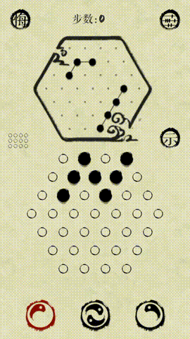
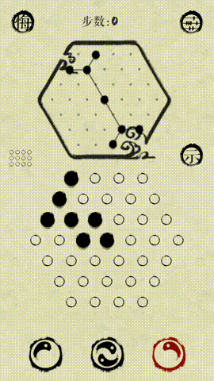
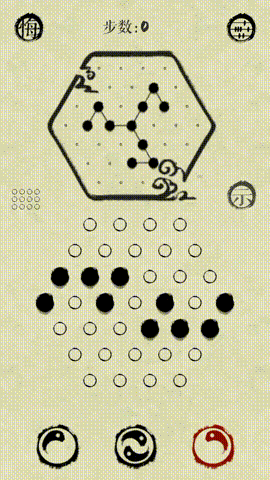
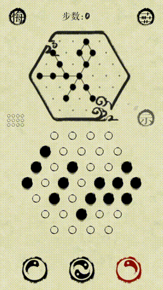
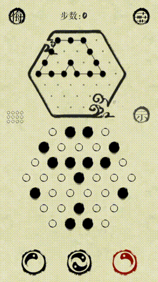
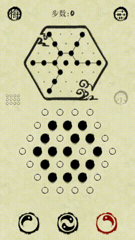

# game
游戏，微信小程序

更多详细介绍：[匿名的博客](https://blog.csdn.net/lcl1997 "匿名的博客")

[同一个世界](src/solved/the_same_world)
> 

[最强连一连](src/solved/most_link_link)
> 微信小程序最强连一连，程序自动识别方块分布，触摸滑动方块通关

[华容道，klotski](src/solved/klotski)
> 微信小程序华容道，程序搜索最优解，自动识别方块分布，触摸滑动方块通关，支持移动同一方块为一步，直线移动为一步，移动一格为一步三种模式

[墨盘，evlover](src/solved/evlover)
> 墨盘，双向广度优先搜索，以下10关解法均比官方提示步数快一步

| 关卡 | 关卡 | 关卡 | 关卡 | 关卡 |
|:----:|:----:|:----:|:----:|:----:|
| VII-3 | VII-6 | VII-7 | X-5 | XI-11 |
|  |  |  |  |  |
| XIII-8 | XIV-6 | XIV-9 | XV-2 | XVI-2 |
|  |  |  |  |  |