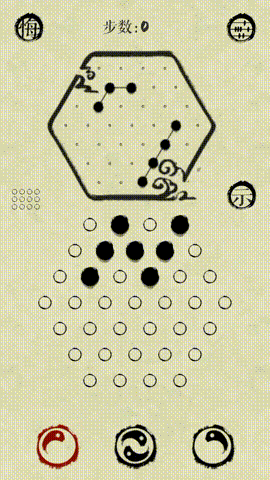
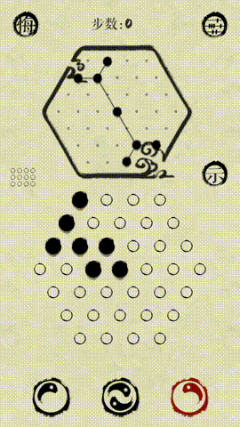
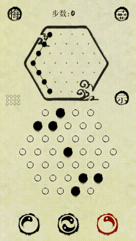
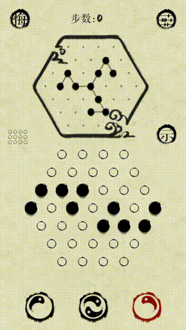
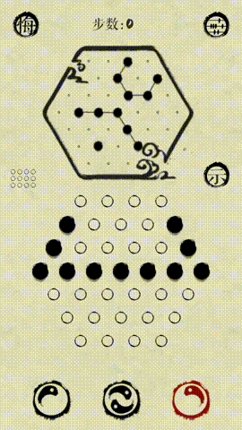
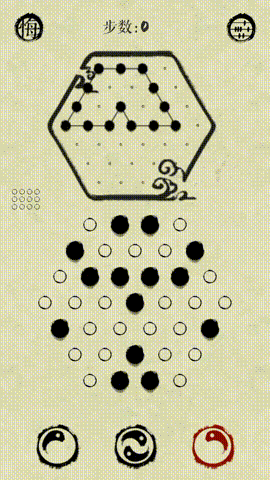
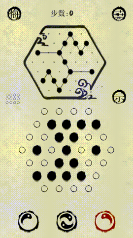
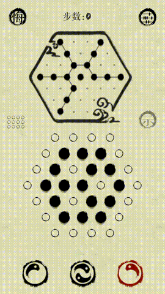

# 游戏

[匿名的博客](https://blog.csdn.net/lcl1997)

[最强连一连](src/main/java/solved/mostlinklink)
> 微信小程序最强连一连，自动识别方块分布

[六边形消消](src/main/java/solved/hexagoneliminate)
> 计算最佳摆放方式，需要安装opencv4.5.1；[HexagonEliminatePlayer.java](src/main/java/solved/hexagoneliminate/HexagonEliminatePlayer.java)的move方法不同手机并不通用

[华容道，klotski](src/main/java/solved/klotski)
> 微信小程序经典三国华容道，自动识别布局，搜索最优解，支持移动同一方块为一步，直线移动为一步，移动一格为一步三种模式；需要安装opencv4.5.1

[墨盘，evlover](src/main/java/solved/evlover)
> 墨盘，以下10关解法均比官方提示步数快一步

| 关卡 | 关卡 | 关卡 | 关卡 | 关卡 |
|:----:|:----:|:----:|:----:|:----:|
| VII-3 | VII-6 | VII-7 | X-5 | XI-11 |
|  |  |  |  |  |
| XIII-8 | XIV-6 | XIV-9 | XV-2 | XVI-2 |
|  |  |  |  |  |

[同一个世界](src/main/java/solved/the_same_world)